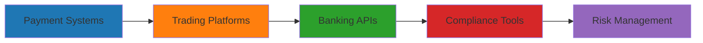

# 👋 Hey, I'm [Your Name]

<div align="center">

```ascii
╔══════════════════════════════════════════════════════════════╗
║  🚀 Senior Full-Stack Developer | Fintech → E-commerce      ║
║  💰 Building the future of payments & commerce experiences   ║
╚══════════════════════════════════════════════════════════════╝
```

[](https://git.io/typing-svg)

</div>

## 💼 Experience

### 🏦 **Fintech Era** (4+ Years)


### 🛒 **E-commerce Transition** (Current)
```javascript
// Building complete e-commerce ecosystems from ground up
const currentWork = {
  platform: 'Medusa.js Dashboard Architecture',
  scope: ['Full E-shops', 'Custom Checkouts', 'Payment Integrations'],
  frontend: ['React', 'Next.js', 'TypeScript'],
  integrations: ['Stripe', 'PayPal', 'Custom APIs', 'Webhooks'],
  performance: 'PageSpeed 80+ Mobile | 100 Desktop',
  styling: ['Tailwind CSS', 'Styled Components']
};
```

## 🛠️ Tech Arsenal

<div align="center">

### Frontend Mastery


### Backend & Database


### Styling & Design


### Cloud & DevOps


</div>

## 📊 GitHub Analytics

<div align="center">
  
  
</div>

<div align="center">
  
</div>

## 🚀 What I'm Building

**🛍️ Complete E-commerce Ecosystems**
- Full-featured online stores with custom Medusa.js dashboards
- Seamless checkout experiences with multiple payment gateways
- API integrations (Stripe, PayPal, inventory systems, shipping providers)
- Performance optimizations across the stack

## 🌐 Let's Connect

<div align="center">

[](https://www.linkedin.com/in/Midunas/)

</div>

---

<div align="center">

### 💭 Random Dev Quote


### 🎵 Currently Coding To
[](https://open.spotify.com/user/yourusername)

</div>

<div align="center">
  
</div>

---

<div align="center">

**⭐ Star my repositories if you find them interesting!**

*Building the future, one commit at a time* 🚀

</div>
